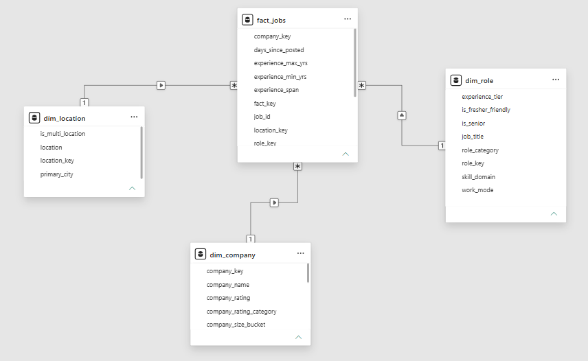

# 📊 Indian Tech Job Market Analysis


---

> ### 🚀 An end-to-end Data Analytics project that analyzes hiring trends, salary patterns, technical skills, work modes, and experience requirements across the Indian technology job market using **Python, MySQL, SQL, and Power BI**.

---

# 📌 Project Overview

The Indian technology industry continues to experience rapid growth, creating strong demand for professionals across domains such as Data Analytics, Artificial Intelligence, Machine Learning, Cloud Computing, Business Intelligence, and Data Engineering.

Understanding this evolving job market requires more than simply counting job postings. Recruiters, job seekers, and business leaders need meaningful insights into hiring demand, salary trends, required technical skills, preferred work modes, and experience expectations.

This project transforms raw technology job posting data into a comprehensive Business Intelligence solution by implementing a complete data analytics workflow consisting of:

* ✅ Data Ingestion
* ✅ Data Cleaning & Preprocessing
* ✅ Feature Engineering
* ✅ Star Schema Data Warehouse Design
* ✅ SQL-Based Business Analysis
* ✅ Interactive Power BI Dashboards
* ✅ Business Insights & Recommendations

The final solution enables users to explore hiring patterns, compare salary trends, identify in-demand skills, and derive actionable business insights from the Indian technology job market.

---

# ❓ Problem Statement

Technology job postings contain valuable information regarding hiring demand, salary ranges, required technical skills, work arrangements, and experience expectations. However, this information is often fragmented and difficult to analyze without a structured analytical approach.

The objective of this project is to transform raw job posting data into meaningful business insights by designing an end-to-end analytics solution that supports data-driven decision-making for recruiters, job seekers, and business stakeholders.

---

# 🎯 Project Objectives

This project aims to:

* Analyze hiring demand across major technology roles.
* Identify the highest-paying job roles and technical domains.
* Examine salary progression across different experience levels.
* Compare Remote, Hybrid, and On-site hiring trends.
* Analyze hiring demand across Indian cities.
* Identify the most in-demand technical skill domains.
* Design a dimensional data warehouse using a Star Schema.
* Develop interactive dashboards using Power BI.
* Demonstrate an end-to-end Data Analytics workflow using industry-standard tools.

## 📋 Project Information

| Category               | Details                                     |
| ---------------------- | ------------------------------------------- |
| **Project Name**       | Indian Tech Job Market Analysis             |
| **Domain**             | Data Analytics                              |
| **Industry**           | Information Technology                      |
| **Dataset**            | Indian Technology Job Postings              |
| **Tools Used**         | Python, Pandas, NumPy, MySQL, SQL, Power BI |
| **Data Warehouse**     | Star Schema                                 |
| **Visualization Tool** | Power BI Desktop                            |
| **Project Type**       | End-to-End Data Analytics Project           |
| **Status**             | ✅ Completed                                 |

# 🛠️ Tech Stack

### Programming & Analysis

* Python
* SQL

### Python Libraries

* Pandas
* NumPy
* Matplotlib

### Database

* MySQL

### Business Intelligence

* Power BI Desktop

### Development Environment

* Jupyter Notebook

### Version Control

* Git & GitHub

# 🔄 Project Workflow

The project follows a complete end-to-end Data Analytics workflow:

1. **Data Collection**

   * Imported the raw Indian technology job postings dataset.

2. **Data Cleaning & Preprocessing**

   * Handled missing values.
   * Removed inconsistencies.
   * Standardized categorical values.
   * Created derived features for analysis.

3. **Data Warehouse Development**

   * Designed a Star Schema.
   * Created dimension tables.
   * Built the central fact table.
   * Loaded transformed data into MySQL.

4. **SQL Business Analysis**

   * Performed analytical SQL queries.
   * Validated warehouse consistency.
   * Generated business metrics.

5. **Power BI Dashboard Development**

   * Built interactive dashboards.
   * Created DAX measures.
   * Added slicers and cross-filtering.
   * Designed business-friendly visualizations.

6. **Business Insights**

   * Identified hiring trends.
   * Analyzed salary patterns.
   * Examined experience requirements.
   * Evaluated work mode preferences.
   * Identified high-demand technical skills.

# 📂 Dataset Overview

The analysis is based on a dataset containing technology job postings across India.

The dataset includes information such as:

* Job Role
* Company Name
* City
* Work Mode
* Experience Required
* Technical Skills
* Salary Information
* Skill Domain

The dataset was cleaned, transformed, and modeled into a Star Schema before performing SQL analysis and Power BI visualization.

# ⭐ Star Schema Design

A dimensional data warehouse was designed using the **Star Schema** approach to improve analytical performance and simplify reporting.

The model consists of one central fact table connected to multiple dimension tables.



# 📊 Power BI Dashboard

The final Power BI report consists of three interactive dashboard pages designed to provide insights into the Indian technology job market.

## 1️⃣ Executive Overview

Provides a high-level summary of the job market, including:

* Total Jobs
* Total Companies
* Average Salary
* Salary Disclosure Rate
* Top Hiring Roles
* Top Hiring Cities
* Work Mode Distribution


---

## 2️⃣ Salary & Compensation Analysis

Analyzes salary trends across different dimensions.

Key highlights include:

* Salary by Job Role
* Salary by Skill Domain
* Salary by Company
* Salary by Work Mode
* Salary by Experience Tier


---

## 3️⃣ Experience & Skills Analysis

Focuses on experience requirements and technical skill demand.

Key highlights include:

* Experience-wise Hiring
* Skill Domain Demand
* Average Skills Required
* Experience vs Salary
* Role vs Experience Matrix


# ❓ Business Questions Answered

This project answers the following business questions:

1. Which technology roles have the highest hiring demand?
2. Which Indian cities offer the most technology job opportunities?
3. Which companies hire the most technology professionals?
4. Which job roles offer the highest average salaries?
5. Which technical skill domains command the highest salaries?
6. How does salary vary across different work modes?
7. Which companies offer the highest average salaries?
8. How does salary change with increasing experience?
9. What percentage of jobs are Remote, Hybrid, and On-site?
10. Which experience level has the highest hiring demand?
11. Which skill domains require the highest number of technical skills?
12. How does hiring demand vary across experience levels for different job roles?

# 💡 Key Business Insights

* Business Intelligence is the most in-demand skill domain, accounting for over **11,000** job postings.
* Data Scientist is the most frequently advertised technology role in the dataset.
* Mumbai, Bangalore, Chennai, and Pune are the leading technology hiring hubs.
* On-site jobs dominate the market, representing approximately **80.6%** of all job postings.
* Cloud & DevOps offers the highest average salary among all analyzed skill domains.
* Salary generally increases with experience, with Lead/Architect roles receiving the highest average compensation.
* Most technology job postings target Mid-level (3–5 Years) professionals.
* Salary disclosure is available for only a subset of job postings, highlighting the continued prevalence of undisclosed compensation in the industry.

# 📈 Business Recommendations

Based on the analysis, the following recommendations can be made:

* Professionals seeking higher compensation should consider developing expertise in Cloud & DevOps, AI/ML, and Data Engineering.
* Job seekers targeting maximum opportunities should prioritize major technology hubs such as Mumbai, Bangalore, Chennai, and Pune.
* Early-career professionals should focus on acquiring practical technical skills to transition into Mid-level roles, where hiring demand is highest.
* Organizations should consider improving salary transparency to attract stronger talent.
* Recruiters can align hiring strategies with the most in-demand technical domains to remain competitive.

# 📁 Repository Structure

```text
Indian-Tech-Job-Market-Analysis
│
├── Data
│   ├── indian_techjobs_2026.csv
│   └── job_market_analysis_final.csv
│
├── Images
│   ├── dashboard_1_executive_overview.png
│   ├── dashboard_2_salary_compensation.png
│   ├── dashboard_3_experience_skills.png
│   └── star_schema.png
│
├── Jupyter
│   ├── 01_Data_Ingestion_and_Preprocessing.ipynb
│   ├── 02_Data_Warehouse_Development.ipynb
│   ├── 03_SQL_Business_Analysis.ipynb
│   └── 04_Business_Insights.ipynb
│
├── PowerBI
│   └── JOB_MARKET_ANALYTICS.pbix
│
├── SQL
│   └── README.md
│
├── README.md
└── LICENSE
```

# 🚀 Future Improvements

Potential enhancements for future versions of this project include:

* Integration with live job APIs for real-time analytics.
* Automated ETL pipelines using Apache Airflow.
* Predictive salary modeling using Machine Learning.
* Deployment of dashboards through the Power BI Service.
* Interactive web application using Streamlit.
* Time-series analysis to monitor hiring trends over time.

# 👨‍💻 About the Author

**Sagar Gupta**

Aspiring Data Analyst with hands-on experience in Python, SQL, MySQL, Power BI, and data warehouse design. Passionate about transforming raw data into meaningful business insights through end-to-end analytics projects.

If you found this project useful, feel free to ⭐ the repository.
